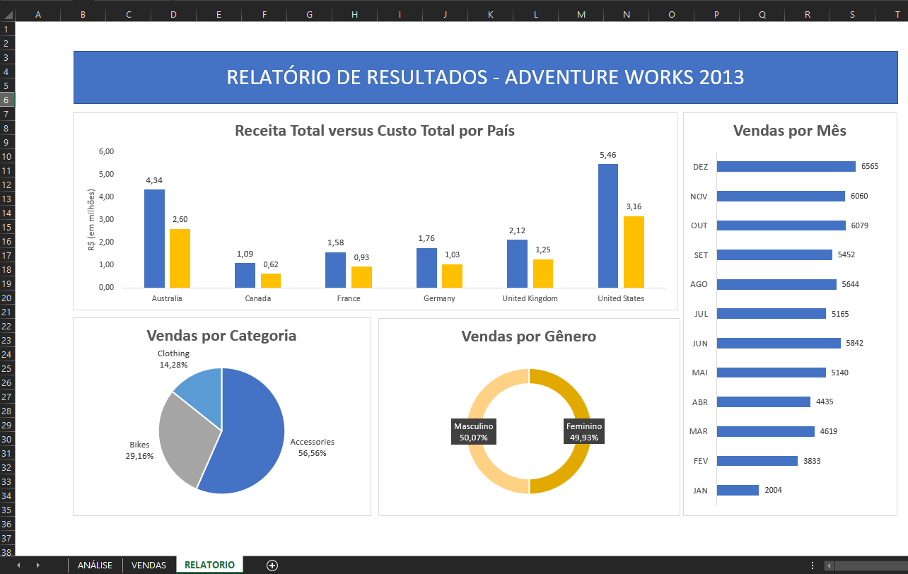
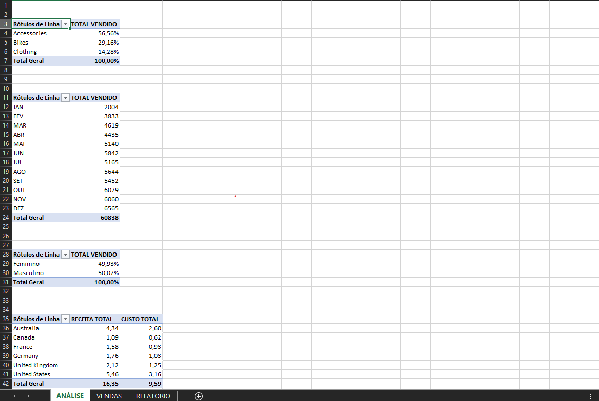

# Integração SQL Server e Excel: Dashboard de Vendas (2013)

Projeto prático que desenvolvi durante o curso **SQL Impressionador da Hashtag Treinamentos**. A ideia aqui foi conectar o **SQL Server** diretamente ao **Microsoft Excel** para criar um dashboard dinâmico de vendas.

---

## 📌 Como funciona o projeto

Em vez de ficar exportando planilhas estáticas toda vez que a base muda, o Excel foi conectado diretamente a uma **View** tratada dentro do SQL Server. Dessa forma, qualquer alteração ou inserção no banco reflete automaticamente nos gráficos assim que a conexão é atualizada.

### Métricas para o relatório (Ano 2013):
1. **Vendas por Categoria:** Qual a participação de cada categoria no volume total?
2. **Evolução Mensal:** Como se comportou a receita mês a mês ao longo do ano?
3. **Receita x Custo por País:** Qual o resultado financeiro em cada território?
4. **Perfil do Cliente:** Qual a proporção de vendas entre o público feminino e masculino?



---

## 🗄️ Base de Dados e Estrutura SQL

Para este projeto, utilizei o banco de dados **AdventureWorks 2014** da Microsoft, focando a análise na tabela de vendas da internet (`FactInternetSales`) e filtrando apenas as movimentações do ano de 2013.

Para consolidar as informações necessárias para os indicadores, cruzei a tabela fato com as dimensões de cliente, território e produto. Como a categoria do produto fica a algumas tabelas de distância, fiz um relacionamento em cadeia (`DimProduct` ➔ `DimProductSubcategory` ➔ `DimProductCategory`). 

Com todas essas junções e tratamentos definidos, criei a View `VENDAS_INTERNET` para centralizar a consulta final que alimenta o Excel:

```sql
CREATE OR ALTER VIEW VENDAS_INTERNET AS
SELECT
    fis.SalesOrderNumber AS 'Nº PEDIDO',
    fis.OrderDate AS 'DATA PEDIDO',
    dpc.EnglishProductCategoryName AS 'CATEGORIA PRODUTO',
    dc.FirstName + ' ' + dc.LastName AS 'NOME CLIENTE',
    dc.Gender AS 'SEXO',
    SalesTerritoryCountry AS 'PAÍS',
    fis.OrderQuantity AS 'QTD. VENDIDA',
    fis.TotalProductCost AS 'CUSTO VENDA',
    fis.SalesAmount AS 'RECEITA VENDA'
FROM FactInternetSales fis
INNER JOIN DimProduct dp ON fis.ProductKey = dp.ProductKey
    INNER JOIN DimProductSubcategory dps ON dp.ProductSubcategoryKey = dps.ProductSubcategoryKey
        INNER JOIN DimProductCategory dpc ON dps.ProductCategoryKey = dpc.ProductCategoryKey
INNER JOIN DimCustomer dc ON fis.CustomerKey = dc.CustomerKey
INNER JOIN DimSalesTerritory dst ON fis.SalesTerritoryKey = dst.SalesTerritoryKey
WHERE YEAR(OrderDate) = 2013
```

O download do banco oficial (AdventureWorksDW2014.bak) pode ser feito direto pelo link: https://docs.microsoft.com/pt-br/sql/samples/adventureworks-install-configure?view=sql-server-ver16&tabs=ssms

## 📊 Construção no Excel

Com a conexão nativa criada no Excel apontando para a View do banco, criei a aba `ANÁLISE` com quatro Tabelas Dinâmicas para servir de base pros gráficos. 

Na ordem de exibição (de cima para baixo), as tabelas correspondem respectivamente a:

1. **Porcentagem de vendas por Categoria:** Distribuição do total vendido entre os tipos de produto.
2. **Volume de vendas por Mês:** Quantidade total de itens vendidos mês a mês ao longo do ano.
3. **Distribuição por Gênero:** Proporção percentual de vendas entre o público feminino e masculino.
4. **Receita e Custo por País:** Levantamento financeiro total agrupado por localização.



> **Nota:** Os valores de Receita e Custo por País foram divididos por 1.000.000 (em milhões) para simplificar a leitura no gráfico.

## 📁 Estrutura do Repositório

```text
analise-vendas-sql-excel/
├── excel/
│   └── dashboard-vendas.xlsx
├── img/
│   ├── analise.png
│   ├── relatorio.png
│   └── vendas.png
├── sql/
│   └── create-view.sql
├── .gitignore
└── README.md
```